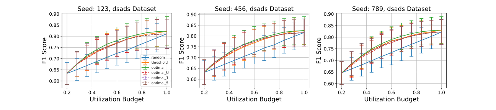
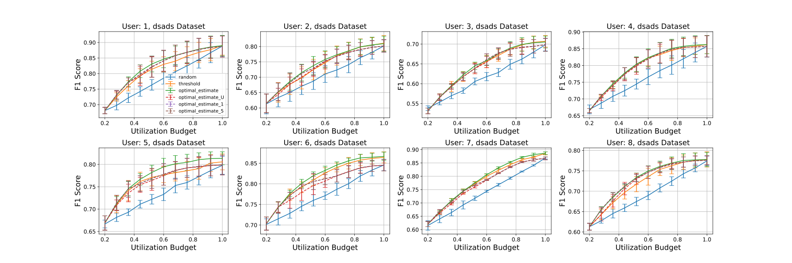
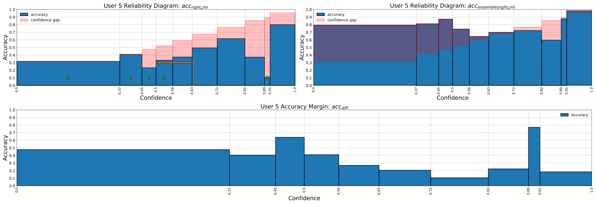

# beyond_thresholds
(IoTDI 2024) Beyond Thresholds: A General Approach to Sensor Selection for Practical Deep Learning-based HAR


# Environment Setup  
Create a conda environment for *sensor selection*  
```
conda create --name sensel python=3.10
conda activate sensel
```  

Install the necessary packages  
```
conda install pytorch torchvision torchaudio pytorch-cuda=11.8 -c pytorch -c nvidia
conda install pandas
conda install matplotlib
conda install scikit-learn
pip install tensorboard
pip install ptflops==0.7
```

Add the root of the project (wherever it is saved on your machine) to the python path
```
export PYTHONPATH="$HOME/Projects/beyond_thresholds"
```

# Preparing Datasets
Download the datasets to top level directory
```console
user:~/Projects/beyond_thresholds$ cd raw_data

// unload DSADS
user:~/Projects/beyond_thresholds$ wget https://archive.ics.uci.edu/static/public/256/daily+and+sports+activities.zip
user:~/Projects/beyond_thresholds$ unzip daily+and+sports+activities.zip -d dsads
user:~/Projects/beyond_thresholds$ rm daily+and+sports+activities.zip

// unload opportunity
user:~/Projects/beyond_thresholds$ wget https://archive.ics.uci.edu/static/public/226/opportunity+activity+recognition.zip
user:~/Projects/beyond_thresholds$ unzip opportunity+activity+recognition.zip -d opportunity
user:~/Projects/beyond_thresholds$ rm opportunity+activity+recognition.zip

// unload RWHAR
user:~/Projects/beyond_thresholds$ wget http://wifo5-14.informatik.uni-mannheim.de/sensor/dataset/realworld2016/realworld2016_dataset.zip
user:~/Projects/beyond_thresholds$ mkdir -p rwhar/data && unzip realworld2016_dataset.zip -d rwhar/data
user:~/Projects/beyond_thresholds$ rm realworld2016_dataset.zip
./unload_rwhar.sh
```

Preprocess the datasets (segment and organize data)
```console
// preprocess DSADS
user:~/Projects/beyond_thresholds$ cd datasets/dsads
user:~/Projects/beyond_thresholds/datasets/dsads$ python preprocess.py
user:~/Projects/beyond_thresholds/datasets/dsads$ cd ..

// preprocess opportunity
user:~/Projects/beyond_thresholds/datasets$ cd opportunity
user:~/Projects/beyond_thresholds/datasets/opportunity$ python preprocess.py
user:~/Projects/beyond_thresholds/datasets/opportunity$ cd ..

// preprocess RWHAR
user:~/Projects/beyond_thresholdsdatasets/$ cd rwhar
user:~/Projects/beyond_thresholds/datasets/rwhar$ python preprocess.py
user:~/Projects/beyond_thresholds/datasets/rwhar$ cd ../..
```

# Training
For each body part in each dataset, we train a model in a leave-one-person-out fashion using 3 random seeds. This means we train on the data from all users except for one, then test on the held out user. Thus, for a dataset with $K$ body parts and $U$ users, we train $K\cdot U\cdot 3$ models. We also train models with *early fusion* for reference but do not use them.

*For convenience, all the checkpoints are already provided under ```beyond_thresholds/saved_data/checkpoints``` if you do not want to train all the models from scratch*

Train the models (skip this step if you want to use pretrained models). Given the small size of the models, training can be done on CPU if needed. **Note:** if you train from scratch, delete or rename the folders under ```beyond_thresholds/saved_data/checkpoints```. Otherwise models in these folders will be identified as having already been trained.
```console
// training for DSADS
user:~/Projects/beyond_thresholds$ cd training
user:~/Projects/beyond_thresholds/training$ python main_dsads.py

// training for opportunity
user:~/Projects/beyond_thresholds/training$ python main_opportunity.py

// training for RWHAR
user:~/Projects/beyond_thresholds/training$ python main_rwhar.py
user:~/Projects/beyond_thresholds/training$ cd ..
```

You can monitor training with tensorboard
```console
user:~/Projects/beyond_thresholds$ cd saved_data/runs/dsads
user:~/Projects/beyond_thresholds/saved_data/runs/dsads$ tensorboard --logdir='./'
```

# Saving Predictions
For sensor selection, we only need the model predictions (confidence value and class prediction) so we can cache these
```console
// caching for DSADS
user:~/Projects/beyond_thresholds$ cd training
user:~/Projects/beyond_thresholds/training$ python cache_predictions_dsads.py

// caching for opportunity
user:~/Projects/beyond_thresholds/training$ python cache_predictions_opportunity.py

// caching for RWHAR
user:~/Projects/beyond_thresholds/training$ python cache_predictions_rwhar.py
user:~/Projects/beyond_thresholds/training$ cd ..
```

# Sensor Selection
Next we need to derive the policies and evaluate them. This can be done on a per dataset or per seed or per policy basis. Here we just run a bash script which derives and evaluates all policies across all seeds and datasets. This will populate ```saved_data```.
```console
user:~/Projects/beyond_thresholds/training$ cd sensor_selection
user:~/Projects/beyond_thresholds/sensor_selection$ ./run_all
```

Finally, we can visualize the results for each dataset. Running the following will generate figures as svg.
```console
user:~/Projects/beyond_thresholds/sensor_selection$ python plot_results.py --dataset=dsads
user:~/Projects/beyond_thresholds/sensor_selection$ python plot_results.py --dataset=opportunity
user:~/Projects/beyond_thresholds/sensor_selection$ python plot_results.py --dataset=rwhar
```



# Reliability Diagrams
We can also visualize the reliability diagrams for different sensors to better interpret their policies.
```console
user:~/Projects/beyond_thresholds/sensor_selection$ python plot_reliability_diagram.py --dataset=dsads --user=5 --body_part=right_arm --ens_frac=0.5
```
